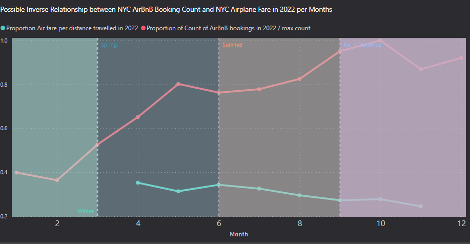
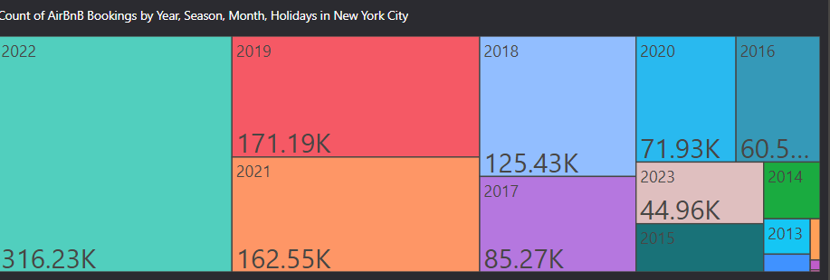

# Factors influencing New York City Airbnb bookings 
## Authors
[Alex Reilly](https://github.com/reilly-alex), [Miko Le](https://github.com/miko-le), [Shirley Cho](https://github.com/snowwly)

## Table of Contents
- [Introduction](#introduction)
- [Questions](#questions)
- [Requirements](#requirements)
- [Data Processing & ETL](#data-processing--etl)
- [Code for ETL process](#code-for-etl-process)
- [Machine Learning](#code-for-machine-learning)
- [Dashboard & Visualizations](#visualizations)
- [Results](#results)
- [Sources](#sources)

## [Introduction](#table-of-contents)

New York City Airbnbs has been a topic that has been trending since they passed the short-term rental law in 2022 in order to possibly help the NYC neighborhood have more stable neighborhood communities and mitigate changes in the housing market. However, we attempt to look at an indepth analysis on how Airbnb hosts, listings, bookings, and prices tend to trend within NYC and also take in outside data sources to see how external factors might also be affecting Airbnb in NYC. These factors include looks into crime, seasonality, hotel competition, rental home, airplane fares, etc in order to analyze how airbnbs popularity and prices trend with these outside factors. 

We hope that with our information, NYC officials can make more informed decisions on their outlook towards Airbnbs in NYC that would create actionable policies and laws that would benefit everyone. Our data will attempt to answer the following questions about NYC Airbnbs:

## [Questions](#table-of-contents)
1. What are the most expensive and least expensive areas for Airbnbs in New York City? 
2. When is the most popular time of the year to book airbnb in New York? (seasonal, bring in holidays)
3. What are the allowed average stay lengths?
4. Count of Airbnbs bookings over time
5. Count of properties per host
6. What amenities affect price most?
7. What factors will affect the review ratings of Airbnb? Can we use them to predict the ratings of Airbnb?
8. Trends of average price of rental homes in new york from zillow data vs trend of average price of airbnb in new york to see any trends by month, year
9. Are hotels more expensive on average compared to Airbnbs?
10. Does the amount of crime in each borough have any impact on the amount of airbnb bookings? How about tourist attractions? 
11. Does Airplane fare prices affect AirBnB bookings and when is that?

>Answers to our questions and visualizations for our data analysis can be found in our "Results" section from the table of contents in our Technical Project Report

## [Requirements](#table-of-contents)
- pandas
- numpy
- pyspark
- matplotlib
- pymssql
- scikit-learn

## [Data Processing & ETL](#table-of-contents)

[Data Pipeline](./Project_Specifications/DataPlatform.pdf)

[ERD Diagram](./Project_Specifications/ERD.pdf)

[ETL Report](./Project_Specifications/ETLReport.pdf)

## [Code for ETL process](#table-of-contents)

[Exploratory Data Analysis Code](./EDA/)

[Python Code for Cleaning Data](./Code/)

[Code for DDL and DML for loading into SQL Database](./SQLDB/)

## [Code for Machine Learning](#table-of-contents)

[Machine Learning Code](https://github.com/snowwly/DataCapstone_Group3/tree/main/Machine_Learning)

## [Dashboard & Visualizations](#table-of-contents)

[Dashboard PDF Files](https://github.com/snowwly/DataCapstone_Group3/blob/main/Project_Specifications/Dashboard.pdf)

[PowerBI Dashboard Link](https://app.powerbi.com/groups/9cd692c1-cde9-402d-8d1f-884c5c68117f/list)

Example Images

## [Results](#table-of-contents)
[Technical Project Report]

## [Sources](#table-of-contents)
[Data Sources](https://github.com/snowwly/DataCapstone_Group3/blob/main/Project_Specifications/Data_Sources.pdf)

